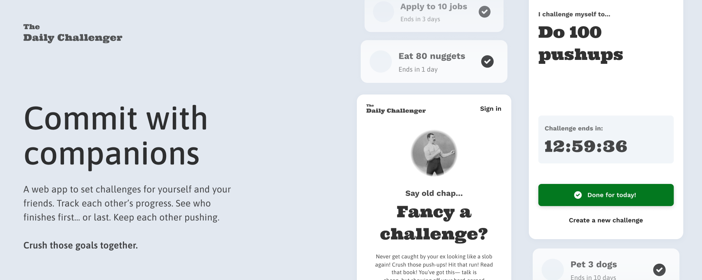

<div align="center">
  <br />
    <a href="https://youtu.be/EZajJGOMWas" target="_blank">
      
    </a>
  <br />

  <div>
    
    
    
    
    
    

  </div>

  <h3 align="center">Daily Challenger</h3>****

   <div align="center">
     Crush Goals, Build Habits, and Share the Journey
    </div>
</div>

## 📋 <a name="table">Table of Contents</a>

1. 🤖 [Introduction](#introduction)
2. ⚙️ [Tech Stack](#tech-stack)
3. 🔋 [Features](#features)
4. 🤸 [Quick Start](#quick-start)
5. 🕸️ [Snippets](#snippets)
6. 🚀 [More](#more)

## <a name="introduction">🤖 Introduction</a>

Built with Vite, TypeScript, Supabase, and Postgres, Daily Challenger is a production-grade platform designed to help you set and track your daily personal challenges. It features a dynamic public interface paired with an intuitive admin dashboard, making it easy to log your progress and update your goals. With functionalities like automated daily challenge scheduling, progress tracking, and a social feed to view your friends’ challenges and achievements, Daily Challenger fosters accountability and motivation.

Powered by a modern, optimized tech stack for real-world scalability, the platform not only helps you stay on track with your own goals but also connects you with a community of like-minded individuals to celebrate successes and overcome challenges.

## <a name="tech-stack">⚙️ Tech Stack</a>

- Javascript
- React
- Typescript
- Vite
- Clerk
- Motion
- Supabase
- Zustand

## <a name="features">🔋 Features</a>

### Features of the Daily Challenger Web App

👉 **Microservice Authentication**: 3rd-party authentication powered by Clerk, offering seamless sign-up, sign-in, user profile management, and support for existing email addresses.

👉 **Home Page**: Highlighted books and newly added books with 3D effects.

## <a name="quick-start">🤸 Quick Start</a>

Follow these steps to set up the project locally on your machine.

**Prerequisites**

Make sure you have the following installed on your machine:

- [Git](https://git-scm.com/)
- [Node.js](https://nodejs.org/en)
- [npm](https://www.npmjs.com/) (Node Package Manager)

**Cloning the Repository**

```bash
git clone https://github.com/adrianhajdin/university-library-jsm.git
cd university-library-jsm
```

**Installation**

Install the project dependencies using npm:

```bash
npm install
```

**Set Up Environment Variables**

Create a new file named `.env` in the root of your project and add the following content:

```env
NEXT_PUBLIC_IMAGEKIT_PUBLIC_KEY=
IMAGEKIT_PRIVATE_KEY=
NEXT_PUBLIC_IMAGEKIT_URL_ENDPOINT=

NEXT_PUBLIC_API_ENDPOINT=
NEXT_PUBLIC_PROD_API_ENDPOINT=

DATABASE_URL=

UPSTASH_REDIS_URL=
UPSTASH_REDIS_TOKEN=

AUTH_SECRET=

# Required for workflow
QSTASH_URL=
QSTASH_TOKEN=

# RESEND_TOKEN=
RESEND_TOKEN=
```

Replace the placeholder values with your actual ImageKit, NeonDB, Upstash, and Resend credentials. You can obtain these credentials by signing up on the [ImageKit](https://bit.ly/49zmXkt), [NeonDB](https://fyi.neon.tech/1jsm), [Upstash](https://upstash.com/?utm_source=jsmastery1), and [Resend](https://resend.com/).

**Running the Project**

```bash
npm run dev
```

Open [http://localhost:3000](http://localhost:3000) in your browser to view the project.

## <a name="snippets">🕸️ Snippets</a>

<details>
<summary><code>usePublicStore.ts</code></summary>

```typescript
import { create } from "zustand";

interface PublicStoreState {
  publicChallengerModalOpen: boolean;
  setPublicChallengerModalOpen: (isOpen: boolean) => void;
}

const usePublicStore = create<PublicStoreState>((set) => ({
  publicChallengerModalOpen: false,
  setPublicChallengerModalOpen: (isOpen) =>
    set({ publicChallengerModalOpen: isOpen }),
}));

export default usePublicStore;
```

</details>
<details>
<summary><code>Github Actions Cron Job</code></summary>

```yaml
# Github Actions Cron Job
name: Ping Supabase API

on:
  schedule:
    - cron: "0 0 */2 * *" # Runs every 2 days at midnight (UTC)
  workflow_dispatch: # Allows manual triggering

jobs:
  ping-api:
    runs-on: ubuntu-latest
    steps:
      - name: Send request to Supabase API
        run: |
          curl -X GET "https://acfwjcgwlkveknfqthsn.supabase.co/rest/v1/users" \
          -H "apikey: ${{ secrets.SUPABASE_API_KEY }}"
```

</details>

## <a name="more">🚀 More</a>

**Advance your skills with Next.js Pro Course**

Enjoyed creating this project? Dive deeper into our PRO courses for a richer learning adventure. They're packed with
detailed explanations, cool features, and exercises to boost your skills. Give it a go!
